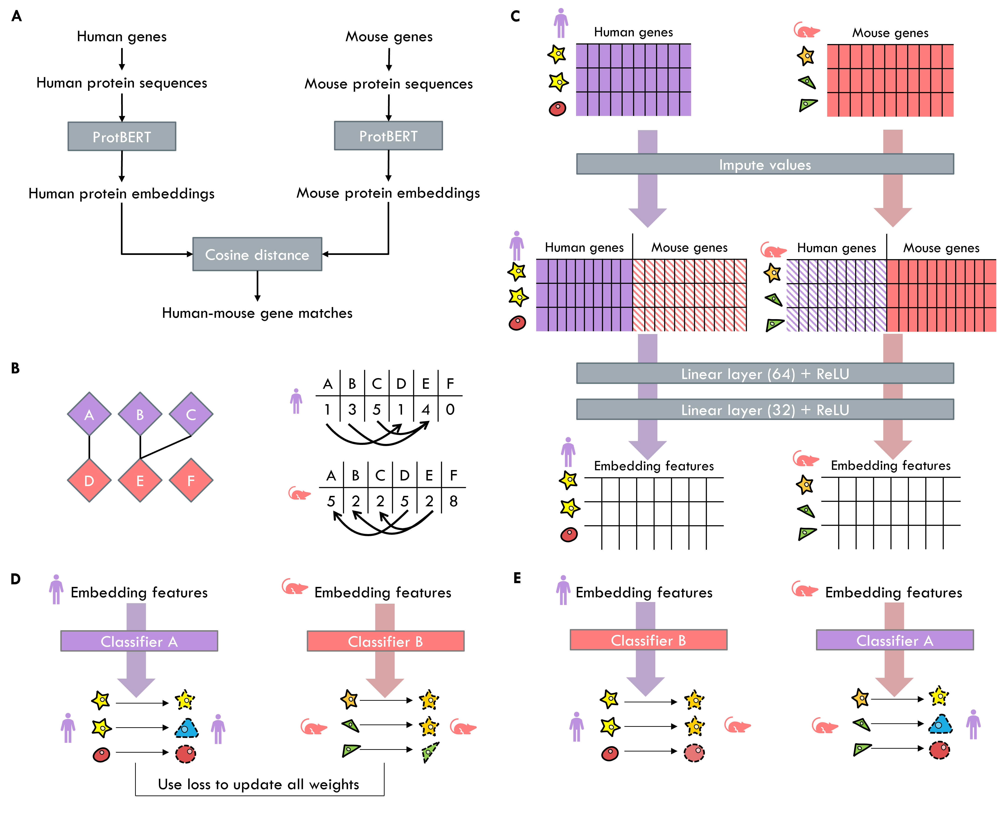

# TACTiCS

## Cell type matching across species using protein embeddings and transfer learning

### Implementation
To train and evaluate TACTiCS, use the `TACTiCS` class in `tactics.py`. As input, `TACTiCS` requires two scRNA-seq datasets and a distance matrix describing the gene similarities. `calc_dist` calculates the latter for embeddings created with `embed_proteins` in `genes.py`. The preprocessed data, trained model and resulting cell embeddings can be saved using `TACTiCS.save`.

For full description, please check the function descriptions.

### Requirements
TACTiCS requires PyTorch. The transformers package is only necessary for embedding protein sequences. 

### Tutorial
The `tutorial.ipynb` notebook explains step-by-step how to use TACTiCS for a comparison across two species, including how to create protein sequence embeddings. 

### Datasets
All datasets used are publicly available. For convenience, the protein sequences, protein embeddings, raw count data and trained models for 50k subsets of the data can be found on [Zonodo](link). The full unprocessed dataset can be downloaded [here](https://doi.org/10.5281/zenodo.6786357).